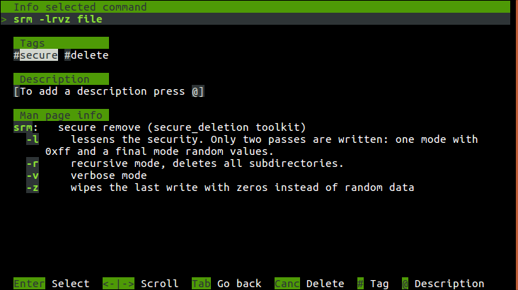

# fastHistory 2.0 - speed up your terminal!

A python tool connected to your terminal to store important commands, search them in a fast way and automatically paste them into your terminal


- [Intro](#Intro)
- [How to install](#How-to-install)
- [Commands and syntax](#Commands-and-syntax)
- [License](#License)

# Intro
### Why you need it?

How often do you need to reuse a command but you cannot remember it (or all the needed options/flags)?

```sh
# example of a common but not so 'easy-to-remember' bash command from my bash history
$ tar -xvf archive.tar.gz
```

How many times do you search the same commands on Google, over and over? 

> 42 times..  yes..  based on my experience the answer is [42](https://www.independent.co.uk/life-style/history/42-the-answer-to-life-the-universe-and-everything-2205734.html)


And how many times have you told yourself to store this *super* useful command but you didn't? 

> I saved them all ..totally, with a good and detailed explanation for each command

if you know what I am talking about, **fastHistory** is the tool you are looking for!


### Usage sample

**fastHistory** can save your commands directly from your terminal, all you need is a **#**

```sh
$ tar -xvf file.tar.gz #
                      /\
                       \------- fastHistory will store "tar -xvf archive.tar.gz" in its internal database
```

You can specify one or more **tags**


```sh
$ tar -xvf file.tar.gz #extract #archive #untar
```

or a **description**

```sh
$ tar -xvf file.tar.gz #@extract compressed files from archive
```

or **both**

```sh
$ tar -xvf archive.tar.gz #untar @extract compressed files from archive
```

To search the saved commands, all you need is **f**

```sh
$ f extract
```

Finally, you only need to press 'enter' to directly paste it into your terminal to be ready to go!


For each saved command you can also get a quick summary of the used options/flags (extracted from the man page) 



**Warning**: this feature currently does not cover the syntax of all commands

Furthermore, you can easily export/import all data to make __backups__ and to share your commands with a different machine

```sh
$ f --export
$ f --import fastHistory_2019-03-23.db
```

# How to install

### Requirements

- `python3`
- `python3-pip` (not needed for offline mode)
    
### Install with pip3

1. `pip3 install fasthistory` *
2. `f` **

\* *do not use `pip` or `sudo`*

\*\* *if command not found, the first time you need to use `~./local/bin/f` instead*

### Install in offline mode

 1.  download the latest release with this *easy-to-type* link or  manually download [it](https://github.com/mkcn/fastHistory/releases)
	 - `wget mkcn.me/f`
 2. (if needed) move it to the remote/offline machine
 3. unzip it
	 -  `tar -xf archive.tar.gz` 
 4. run installed with the target user
	 - `./install.sh`

### Update from old git clone

 - `git pull`
 - `./install.sh`

# Commands and syntax

#### Simple adding

```
<command_to_save> #[<tag> [#<tag> ...]][@<description>]
```

#### Adding without execution

```
# <command_to_save> #[<tag> [#<tag> ...]][@<description>]
```

#### Simple search 

```
f [<filter>]
```

**OR search**: match any row where **at least one** of the following conditions is true:

* the __filter__ words are contained in the **command** 
* the __filter__ words are contained in the **tags** list
* the __filter__ words are contained in the **description**

#### Advanced search
```
f [<filter>] [#<tag_filter> ...] [@<description_filter>]
```

**AND search**: match any rows where **all** the following conditions are true:

* the __filter__ words are contained in the **command** OR **tags** OR **description**
* the __tag_filter__ words are contained in the **tag** list
* the __description_filter__ words contained in the **description**

#### Export database
```
f --export [<output_name>]
```
* the __output__ is the file name of the output database (this parameter is optional)

#### Import external database
```
f --import <input_name>
```

* the __input_name__ is the file name of the input database (e.g. fastHistory_2019-03-23.db)

#### Change fastHistory configuration
```
f --config
```

#### Force a fastHistory setup to fix possible issues
```
f --setup
```

License
----

The license for this is the same as that used by GNU bash, GNU GPL v3+.


Copyright
----

The following external projects have been used as part of **fastHistory**:
*  https://github.com/rcaloras/bash-preexec 
    *  **goal**: this bash script is used to hook the commands from the terminal
    *  **code section**: ```bash-preexec.sh```
    *  **changes**: no change
*  https://github.com/idank/bashlex
    *  **goal**: this Python module is used to parse bash commands in order to show info from the man page
    *  **code section**: ```fastHistory/parser/bashlex/```
    *  **changes**: no change 
*  https://github.com/wong2/pick
    *  **goal**: this Python module has been used to select the option from the menu
    *  **code section**: ```fastHistory/pick```
    *  **changes**: all code has been restructured and adapted with a different UI


